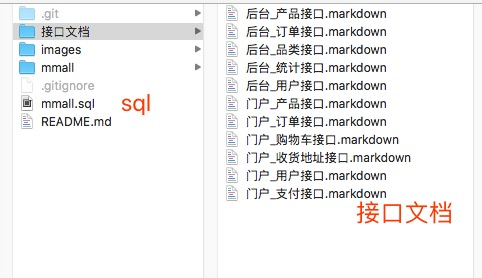
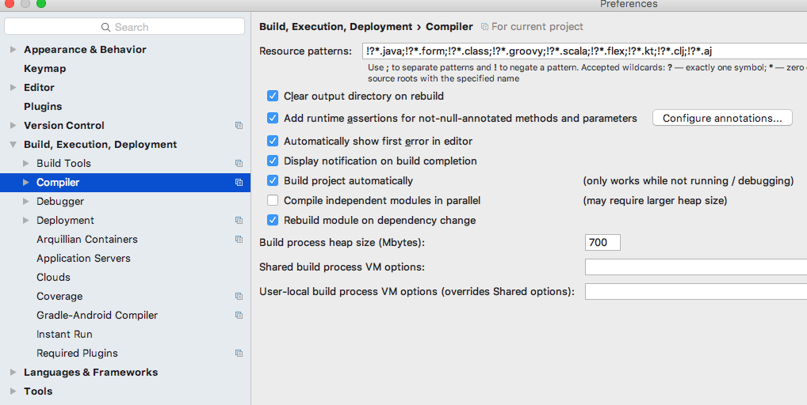
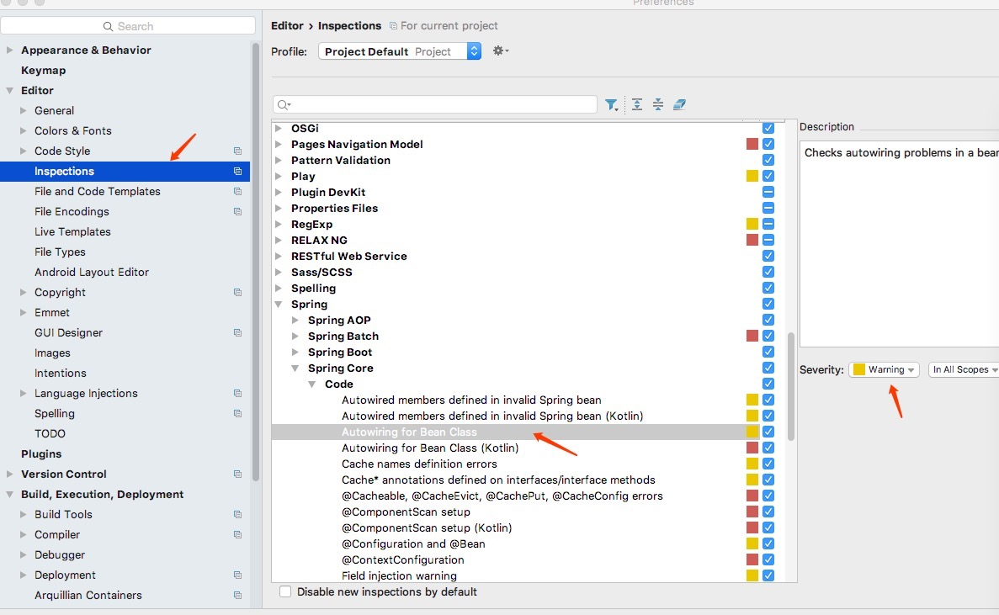

# mmall




## 偏好设置

勾选上图的 Build project automatically



需要修改上图选项为warning


CentOS

```
1.备份
sudo mv /etc/yum.repos.d/CentOS-Base.repo /etc/yum.repos.d/CentOS-Base.repo.backup

2.下载新的CentOS-Base.repo 到/etc/yum.repos.d/
wget -O /etc/yum.repos.d/CentOS-Base.repo http://mirrors.aliyun.com/repo/Centos-7.repo
或者
curl -o /etc/yum.repos.d/CentOS-Base.repo http://mirrors.aliyun.com/repo/Centos-7.repo

3.之后运行yum makecache生成缓存

```

