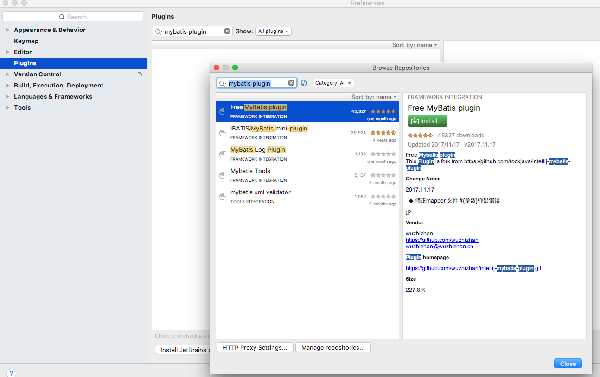

# mmall

## 插件
1.mybatis-generator-maven-plugin能自动生成domain和mappers

2.在idea的偏好设置选plugins,搜索mybatis plugin,安装

3.chome插件需要翻墙（不装了）

restlet可以调试get/post

http://blog.csdn.net/zlp1992/article/details/76706017

## 偏好设置

勾选上图的 Build project automatically

需要修改上图选项为warning